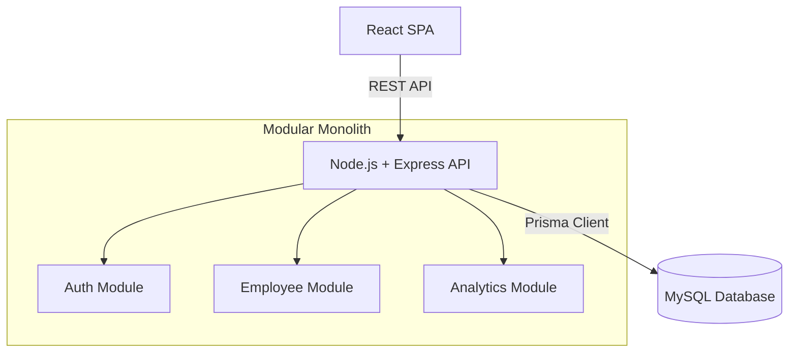

# Architecture Document

## Overview
The application will be built as a **Modular Monolith** using a modern TypeScript stack. This provides a clean separation of concerns and rapid development speed without the operational overhead of distributed microservices.

## Technology Stack
- **Frontend:** React, TypeScript, Redux Toolkit, RTK Query.
- **Backend:** Node.js, Express, TypeScript, Zod (validation).
- **Database:** SQLite, Prisma ORM.

## Architecture Diagram

## Frontend & Backend Boundaries
- **Server State:** Managed via RTK Query on the frontend, serving as a caching layer for REST API responses.
- **Client State:** Minimal. Used primarily for UI interactions managed via React state or Redux Toolkit.
- **API Contract:** Strictly typed. The backend will define the source of truth, and the frontend will consume defined endpoints.

## Domain Boundaries
The backend is structured by domain rather than technical layers:
- `auth`: Authentication and tenant resolution.
- `employees`: Employee CRUD, search, and directory.
- `compensation`: Salary history and updates.
- `analytics`: Aggregated organizational data.

## Multi-Tenancy Approach
- **Model:** Genuine Logical Separation (Row-level multi-tenancy). All tenants share the same MySQL database and schema, with every tenant-owned table including a `tenantId` column.
- **Enforcement:** The `tenantId` context MUST always be derived securely from the authenticated user's session/JWT on the server. The application will never trust a `tenantId` supplied by the client in request bodies or query parameters as an authorization mechanism.
- **Data Access:** All tenant-owned database operations (read, write, update, analytics) must be explicitly tenant-scoped using the derived `tenantId`.
- **Seeding:** The database will be seeded with exactly 10,000 employees distributed across at least two tenants, with ACME serving as the primary demo organization.

## Database Responsibilities
- **Relational Integrity:** MySQL enforces foreign keys and unique constraints.
- **History Preservation:** The database schema is append-only for salaries, preventing overwrites of historical data.

## Observability
- Request tracking via unique correlation IDs.
- Structured JSON logging.
- Health endpoints (`/health/live`, `/health/ready`) for deployment readiness.

## Testing Strategy
- **Test Pyramid:** Heavy emphasis on integration tests for API endpoints and unit tests for business logic, with minimal critical-path E2E tests.
- **TDD Approach:** Core domains (like salary update validation and tenant isolation) will be developed test-first.

## Deployment Approach
- Single containerized Node.js service containing the API and serving static React assets, or decoupled deploy (frontend to Vercel/Netlify, backend to PaaS like Render/Heroku).
